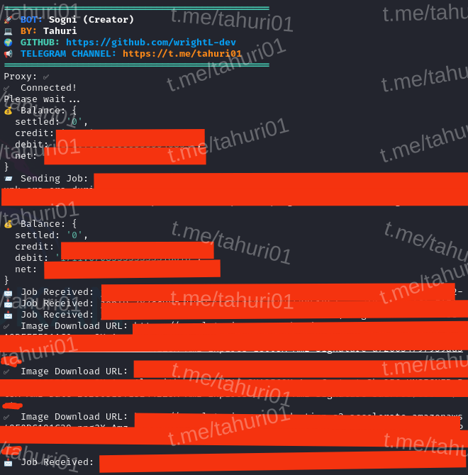

# BOT SOGNI - WEBSITE



**Fitur:**

**• Auto Generate Image**

**• Supports Proxy w/o Proxy**

## Requirements

Before running this project, make sure you have installed:

- Node.js
- npm (Node Package Manager)

## Installation

1. **Clone this repository:**

    ```plaintext
    git clone https://github.com/wrightL-dev/nyogni
    cd nyogni

2. **Install the required packages:**

    ```plaintext
    npm install axios ws https-proxy-agent

3. **Add token in the token.txt file. Example:**

    ```plaintext
    eyxxxxxxxxxx
4. **Add refresh token in the refresh.txt file. Example:**

    ```plaintext
    eyxxxxxxxxxx
5. **If you want to use a proxy, edit the proxy.txt file. Example:**
   ```plaintext
   http://username:password@ip_address:port

6. **Run the script:**
   ```plaintext
   node sogni.js <token>

## Support

If you have any questions or need further assistance, feel free to join our Telegram channel at [t.me/tahuri01](https://t.me/tahuri01).

## License

This project is licensed under the [MIT License](LICENSE).
